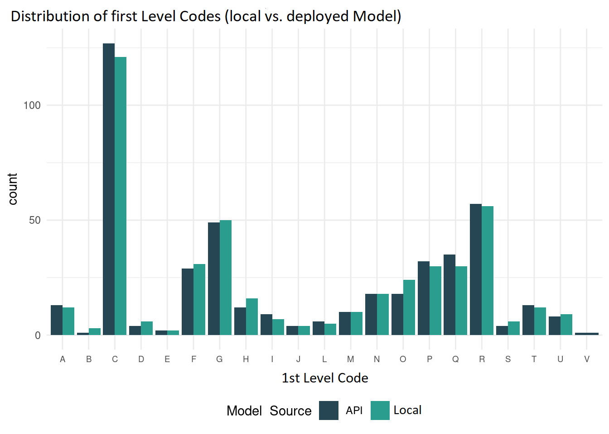
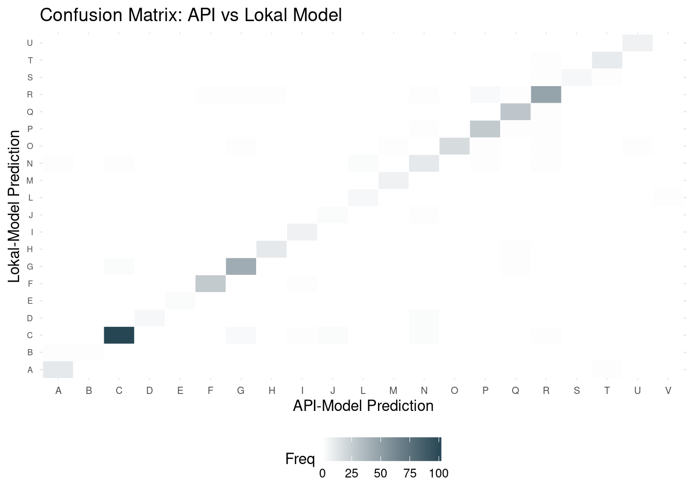

Shipping a model is not the end of the MLOps lifecycle — it is the point where a new class of risks appears. In production, a model is exposed to inputs it never saw during training, to a real world that keeps drifting away from the training distribution, and, for classification tasks, to classifications whose definitions can themselves change over time. None of these failures crash the API: predictions keep flowing, they just slowly get worse, unless something is actively watching.

Two practices close this gap:

- **Observability**: continuously assess whether current predictions can still be trusted. This combines label-free signals (e.g. comparing successive model versions, tracking known hard cases) with label-based ones (accuracy, calibration) whenever ground truth is available, complemented by human review where automation cannot cover everything.
- **Retraining**: turn newly collected and freshly labelled data into a reproducible pipeline that regularly produces a new, validated model version — closing the loop between what monitoring detects and what gets fixed.

::: {.callout-tip}
Observability and retraining are two sides of the same loop: what monitoring flags becomes the training signal for the next model version.
:::

::: {.diagram}
{#fig-monitoring-loop fig-alt="Flow diagram: the production model writes to a prediction log; a confidence threshold routes predictions to auto-coding or human annotation, with a random audit sample also sent to annotation. The prediction log feeds label-free monitoring signals, annotations feed label-based signals and a labelled data store. Alerts and new labelled data trigger a five-step retraining pipeline (trigger, train, validate, shadow, promote) that deploys version N+1."}
:::

This loop is what @google2020mlops calls *continuous training* (MLOps "level 1"): the pipeline, not a person, is what gets deployed, and new model versions are produced by re-running it. @sculley2015hidden list monitoring and feedback loops among the main sources of hidden technical debt in ML systems, and the interview study by @shankar2022operationalizing finds that keeping models healthy *after* deployment is where practitioners spend much of their effort.

# Observability

## What can go wrong: a taxonomy of drift

A text classifier learns the joint distribution $P(X, Y)$ of input texts $X$ and codes $Y$ seen in its training data. In production that distribution changes. The changes are usually grouped into three families [@morenotorres2012unifying; @quinonero2009dataset; @gama2014survey]:

| Type of shift | What changes | Typical example in automatic coding | Detectable without labels? |
|---|---|---|---|
| **Covariate shift** (data drift) | $P(X)$: the inputs | New products or activities (e-scooters, AI consulting…), a new collection mode (app vs. paper diary), changes in the wording of the survey question, spelling habits | Yes |
| **Prior / label shift** | $P(Y)$: the frequency of codes | Seasonality of expenditures (heating, holidays), an economic shock that changes which businesses get created | Partly, through the distribution of *predicted* codes [@lipton2018labelshift] |
| **Concept drift** | $P(Y \mid X)$: the right code for the same text | A **revision of the classification** (NACE Rev. 2 → Rev. 2.1 [@eu2023nace21], COICOP 1999 → COICOP 2018 [@un2018coicop]), new coding guidelines, a legal change | Mostly no: needs fresh labels |

: Main types of dataset shift and how they appear in text-to-code pipelines {#tbl-drift}

On top of these, there is a fourth, very common category: **upstream pipeline failures**. A field gets renamed, an encoding changes, texts are truncated at 50 characters by a new front-end, or a categorical variable silently switches from codes to labels. These are not "drift" statistically speaking, but they look the same from the model's point of view, and they are the easiest to catch with simple input checks [@breck2019datavalidation].

For official statistics, concept drift caused by classification revisions deserves particular attention. Unlike gradual drift, it is **announced in advance** and **abrupt**. The cost is a new labelled dataset in the new version of the classification, usually built by combining correspondence tables, double coding during a transition period, and (increasingly) LLM-assisted relabelling (see the Insee box below).

## What to monitor: four layers

Monitoring is best organised in layers, from the cheapest and fastest signals to the most expensive and most informative ones [@huyen2022designing, ch. 8; @breck2017mltestscore]. None of them works without a prerequisite: **log every prediction** together with its input, its confidence score, the model version that produced it and a timestamp. You cannot monitor what you did not record. Because inputs are often confidential survey answers, the prediction log must follow the same access rights and retention rules as the source data.

**1. Service health.** Is the API up and fast enough? Track latency (median and 95th/99th percentiles), throughput, error rates (HTTP 4xx/5xx) and resource usage. These are classic software metrics, usually collected with tools like [Prometheus](https://prometheus.io/) and shown in [Grafana](https://grafana.com/) [@prometheus]. They say nothing about prediction quality, but they are the first thing to break.

**2. Input data quality and drift.** Are the inputs still what the model expects? Cheap checks on the logged inputs catch most upstream failures and a good share of covariate shift:

- share of empty, very short or obviously invalid texts;
- distribution of text length (in characters or tokens);
- **share of out-of-vocabulary tokens**, i.e. words never seen during training, a good proxy for new vocabulary entering the data;
- distribution of each categorical feature, and the appearance of unseen categories.

For a more formal test, compare a reference window (e.g. the validation set) with the current window using a two-sample test, such as $\chi^2$ for categorical variables, Kolmogorov–Smirnov for continuous ones, or Maximum Mean Discrepancy on text embeddings. @rabanser2019failing compare these methods extensively and find that tests on the *model's own outputs* (next layer) are often the most effective.

**3. Prediction-level signals (label-free).** How is the model behaving? These signals are available immediately and need no ground truth:

- the **distribution of predicted codes**, ideally aggregated at the top levels of the classification (sections, divisions), compared with the reference period;
- the **distribution of confidence scores** and its direct operational counterpart, the **automation rate** (share of predictions above the human-in-the-loop threshold). A sudden drop in automation rate means more work for annotators *and* is often the first visible symptom of drift;
- the **agreement rate between two model versions** on the same inputs (see the Statistics Austria reports below), which is the label-free safeguard before any promotion.

A simple and widely used statistic to compare two categorical distributions (predicted codes, a categorical feature, binned confidence scores) is the **Population Stability Index**:

$$
\text{PSI} = \sum_{k=1}^{K} \left(p_k - q_k\right) \ln \frac{p_k}{q_k}
$$

where $q_k$ is the share of category $k$ in the reference window and $p_k$ its share in the current window. It is a symmetrised Kullback–Leibler divergence. A common rule of thumb reads PSI < 0.1 as "stable", 0.1–0.25 as "moderate shift, investigate" and > 0.25 as "significant shift". These thresholds are conventions, not statistical tests, and should be calibrated on your own historical data.

```{python}
#| eval: false
#| code-fold: show
import numpy as np
import pandas as pd

def psi(reference: pd.Series, current: pd.Series, eps: float = 1e-6) -> float:
    """Population Stability Index between two categorical samples (e.g. predicted NACE sections)."""
    categories = sorted(set(reference) | set(current))
    q = reference.value_counts(normalize=True).reindex(categories, fill_value=0) + eps
    p = current.value_counts(normalize=True).reindex(categories, fill_value=0) + eps
    return float(np.sum((p - q) * np.log(p / q)))

# Compare predicted sections (first letter of the code) this week vs. the validation set
psi_sections = psi(df_val["predicted_code"].str[0], df_week["predicted_code"].str[0])
```

If the model is **well calibrated** (see the Model chapter), its confidence scores can also be used to *estimate* accuracy without labels: the expected accuracy on a batch is simply the mean confidence. Methods such as *Confidence-Based Performance Estimation* (implemented in NannyML [@nannyml]) or *Average Thresholded Confidence* [@garg2022leveraging] build on this idea.

**4. Label-based evaluation.** Is the model still right? This is the only layer that measures quality directly, but labels arrive late and only for part of the data. The usual sources in NSIs are the human-in-the-loop annotations, expert review campaigns and correction lists.

::: {.callout-warning}
## Beware of the human-in-the-loop selection bias

If the only labels you collect come from the human-in-the-loop fallback, you only observe the model's performance on **low-confidence** predictions, the ones it was already unsure about. Accuracy computed on these labels says nothing about the auto-coded records, which are the majority and go straight into the statistics.

To estimate the accuracy of the full production pipeline without bias, set aside a **random audit sample** of auto-coded predictions (stratified by predicted section or by confidence band if needed) and have it annotated regularly. This is a standard survey-sampling problem, and the quality frameworks developed for official statistics apply directly [@yung2022quality].
:::

Once labels are available, compute the **same metrics as at validation time** (accuracy, macro-F1, per-class scores, calibration error) so that production figures can be compared directly with the model's validation report. For the choice of which records to send to annotators beyond the random audit, *active learning* strategies (uncertainty sampling, diversity sampling) can maximise the value of each annotation [@settles2009active; @monarch2021hitl].

## Dashboards and alerts

Signals only help if someone looks at them. Two complementary outputs are common:

- a **dashboard** (Grafana, Superset, Shiny, Streamlit, or a periodic Quarto report) for the regular review by the model owner and domain experts;
- **alerts** on a small number of carefully chosen indicators (e.g. automation rate drops by more than 5 points week-on-week, PSI on predicted sections > 0.25, error rate > 1%), sent to a named owner.

Keep alerts few and actionable to avoid alert fatigue, and write down in advance *what happens when an alert fires*: who investigates, and under which conditions retraining or a rollback is triggered.

Open-source tools can help with drift reports and statistical tests, e.g. [Evidently](https://github.com/evidentlyai/evidently) [@evidently], [NannyML](https://nannyml.readthedocs.io/) [@nannyml] or [Alibi Detect](https://github.com/SeldonIO/alibi-detect) [@alibidetect]. A few pandas aggregations scheduled as a batch job and written to a dashboard are often enough to start.

<details class="insee">
<summary class="insee-header">
  <span class="solutionbox-icon"></span>
  Insee: GRAAL — an agentic approach to monitoring and relabelling
</summary>

<div class="solutionbox-body">
Beyond the automated reports described below, the production NACE coding pipeline (see the Data, Model and Serving chapters) is also watched continuously by human annotators reviewing a sample of live predictions — a signal that complements automated metrics and feeds back into retraining.

That level of continuous annotation isn't sustainable for every pipeline, though, and classifications are periodically revised, forcing costly relabelling of historical data. **GRAAL** (*Graph-based Research with Agents for Automatic Labelling*) is an Insee framework exploring an LLM-based answer to these gaps, for classifiers running fully offline on CPU whose reference knowledge is a set of official notices. An initial zero-shot RAG attempt — embedding notices and company declarations to retrieve the closest match — struggled because short, informal declarations and long, formal notices don't share a comparable embedding space. GRAAL has since moved to a graph-exploring multi-agent system instead: classification notices are modelled as a tree in a **Neo4j** database, and agents navigate it with dedicated tools (fetch a code's definition, list children or siblings...) rather than similarity search, producing an explicit **justification** for every decision instead of an opaque distance score. Today GRAAL is used for monitoring existing API predictions, batch (re)coding on classification changes, and generating synthetic training data — see the full presentation [here](https://inseefrlab.github.io/GRAAL/) [@graal].
</div>
</details>

<details class="austria">
<summary class="austria-header">
Statistics Austria: Monitoring Reports
</summary>

::: solutionbox-body
After each retraining phase, two quality reports are generated to monitor model performance and ensure consistency over time.

The first report focuses on comparing two model versions, typically the most recent model and its predecessor. Since true labels are not required for this comparison, the analysis is based on the models’ predictions. Predictions from both models are collected using the same data inputs. We compute and visualize the overall agreement rate between the models, as well as the distribution of predicted 1-digit codes. In addition, we evaluate a selected set of input texts that are known to be challenging in manual coding. For these cases, we analyze how both model versions classify them and compare the predictions to human annotations. This provides a qualitative assessment of behavioral changes between model versions.

The second report is based on the labeled validation data and therefore allows for a more formal performance evaluation. Standard metrics such as accuracy, top-k accuracy, and F1 score are calculated and visualized. This enables a quantitative assessment of model performance and facilitates comparisons across retraining cycles.

Below are examples of plots inclueded in the quality reports. A simple visualization of predicted first digits codes of the model currently in production, and the newly retrained model helps identify large prediction shifts easily. Severe differences in predictions on the first level may indicate that the newly trained model has learned substantially different patterns or behaves differently from the previous model, and therefore call for further inspection.




For a more detailed comparison of the predictions made by the model currently in production (API model) and the newly retrained local model, confusion matrices can be used. The diagonal represents cases where both models assigned the same first-digit code, while off-diagonal cells indicate disagreements between the two models. A strong concentration of observations along the diagonal therefore suggests a high level of agreement. More pronounced off-diagonal cells, such as the difference observed between the predictions of the two models for code C and G, indicate prediction shifts that may require further inspection.



:::

</details>

<details class="destatis">
<summary class="destatis-header">
  <span class="solutionbox-icon"></span>
  German Federal Statistical Office: Dashboard & HITL (human-in-the-loop)
</summary>

<div class="solutionbox-body">
To ensure a smooth operation and reliability of the machine learning classification system, comprehensive observability measures were implemented. First of all, these include a dashboard that displays up to date operational data. This data is used for key visualizations to track the daily number of labels assigned by the machine learning algortihm, as well as the proportions of different labels assigned each day. Additionally, domain-specific metrics such as the average number and amount of expenses, and the categories used by participating households, are plotted to provide more detailed insights for the domain experts. Deviations in these metrics serve as indicators of anomalies. This proactive monitoring allows to quickly identify and address issues.

Furthermore, a human-in-the-loop approach is integrated where the collected data and the corresponding classifications are reviewed by domain experts. This manual review process ensures that any classification errors are promptly identified and corrected. Large correction lists are maintained to document these errors and facilitate continuous improvement of the system.

In cases where systematic errors with significant impact are detected, we prioritize the retraining of the machine learning algorithm to address these issues and enhance the overall accuracy and reliability of the classification system. This combination of automated monitoring and human oversight ensures robust observability and maintains the integrity of our data classification processes.

</div>
</details>

# Retraining

## When to retrain

There are three common retraining triggers, and most production pipelines combine them [@huyen2022designing, ch. 9]:

- **Scheduled**: retrain at a fixed frequency (monthly, quarterly), usually aligned with the pace at which new labelled data arrives. This is simple and predictable, and is the default at Statistics Austria (quarterly) and Destatis (about every two months).
- **Event-driven**: retrain because something known has changed, such as a classification revision, a new survey wave or a change in the questionnaire, or because experts discovered a systematic error.
- **Metric-driven**: retrain because a monitoring indicator crossed a threshold (drift statistic, automation rate, audited accuracy).

Retraining has a cost: compute, validation effort, qualification on the production platform (see the Serving chapter), and the risk of regressions. The goal is not to retrain as often as possible, but often enough that the model does not degrade between two versions.

## What to retrain on

- **Accumulate, don't replace.** New labelled data is usually *added* to the historical training set rather than replacing it, so the model keeps rare classes it has seen only in older data. A sliding window, which forgets the oldest data, makes sense only when old labels have become wrong, e.g. after a classification change.
- **Apply corrections everywhere.** Expert correction lists should be applied to *both* historical and new data, through the versioned preprocessing step (Data chapter), so the same error does not come back at the next retraining.
- **Never train on the model's own unchecked predictions.** Auto-coded records that were never reviewed must not be fed back as training labels: the model would learn from its own mistakes and strengthen them, a classic *feedback loop* [@sculley2015hidden]. Only human-validated (or explicitly audited) labels belong in the training set.
- **Version everything.** Every retraining produces a new dataset version, new split IDs, a new model version, and a validation report linking them, so that any production version can be traced back to exactly what it was trained on.

## How to promote a retrained model

A retrained model is a *challenger* to the current *champion* in production. Before promotion it should go through the **same automated validation** as described in the Model chapter (same metrics, same test sets, plus the newest labelled data), and a direct comparison with the champion:

- **Offline comparison**: metrics on shared test sets, agreement rate between the two models, and changes in the predicted-code distribution. Large disagreements are not necessarily bad, but each should be explained.
- **Shadow deployment**: the challenger receives a copy of live traffic and its predictions are logged but not used. This tests the full serving path under real conditions without any impact on production [@sato2019cd4ml].
- **Canary or progressive rollout**: if the infrastructure allows it, route a small share of traffic to the challenger first, then increase it.
- **Promotion and rollback**: promotion is a change of tag in the model registry (or of image tag in the GitOps repository), and rollback is the same operation in reverse. If rolling back takes more than a few minutes, fix that before you need it.

The decision to promote should stay a **deliberate, recorded human decision**, made by the model owner, even when every step leading to it is automated.

<details class="insee">
<summary class="insee-header">
  <span class="solutionbox-icon"></span>
  Insee: Retraining stays classic
</summary>

<div class="solutionbox-body">
Retraining itself follows the same standard, reproducible pipeline described in chapter 2: fixed random seeds, versioned train/test/validation splits, and a tracked execution environment. What GRAAL changes is only what happens upstream of it — its batch recoding and synthetic-data generation are used to refresh the labelled dataset when a classification changes version or annotation coverage is too thin, before handing off to that same classic retraining pipeline.
</div>
</details>

<details class="austria">

<summary class="austria-header">
Statistics Austria: Reproducible retraining pipelines
</summary>

::: solutionbox-body
The models are retrained on a quarterly basis as new training data becomes available. During each retraining cycle, the newly collected data is first fetched and combined with the existing historical training dataset to ensure that the model benefits from both recent and previously observed examples.

Based on the updated dataset, new training, test, and validation splits are created using predefined random seeds to ensure reproducibility. The observation IDs belonging to each split are stored so that the exact data partition used for a given model version can always be reconstructed and traced.

The retraining itself follows a standardized and reproducible pipeline, including the reuse of the established hyperparameter configuration and preprocessing steps.

After retraining, the two quality reports, described in section [Observability], are generated. Together, they provide both label-free and label-based evaluations, ensuring that changes in model behavior are detected even when ground-truth data is limited or delayed.
:::

</details>

<details class="destatis">
<summary class="destatis-header">
  <span class="solutionbox-icon"></span>
  German Federal Statistical Office: Retraining pipeline
</summary>

<div class="solutionbox-body">

Retraining of the model takes place approximately every two months to make sure there is no significant data drift. However, as mentioned, if significant errors are known, retraining is done immediately. An ongoing process involves experts providing corrections and feedback through regular testing of the classification systems, resulting in manual correction lists for the training data. These correction lists are applied to both old and new data. If systematic errors are discovered in the data sources, these are corrected through adjustments in the preprocessing step or the affected data is excluded.

Within the training pipeline, the data is initially split into training and test data in an 80/20 ratio with a fixed random seed. This is followed by hyperparameter tuning through repeated training runs to determine the best parameters. The selection of the best model is based on accuracy and the F1-score compared to the old model. Finally, a sanity test is conducted to check the entire classification system, including the model in the implemented application code as well as preprocessing and postprocessing, using prepared test cases. These test cases include, for example, common errors or added corrections.

</div>
</details>

# Checklist {.unnumbered}

::: {.callout-note .checklist icon=false}
## Does my MLOps pipeline verify this?

#### Observability

- [ ] Every prediction is logged with its input, output code, confidence score, model version and timestamp, under the same access and retention rules as the source data.
- [ ] Service health (latency percentiles, throughput, error rate) is tracked automatically.
- [ ] Input quality is checked automatically (empty/short texts, text length, out-of-vocabulary rate, unseen categories).
- [ ] The distribution of predicted codes and of confidence scores is compared with a reference period (e.g. with PSI), at least at the top levels of the classification.
- [ ] The automation rate (share of predictions above the human-in-the-loop threshold) is tracked over time.
- [ ] A **random audit sample** of auto-coded predictions is labelled regularly, so that production accuracy is estimated without the human-in-the-loop selection bias.
- [ ] Complementing the random audit sample, **low-confidence predictions** below a fixed confidence threshold are regularly reviewed and manually labelled, providing targeted hard cases for future retraining.
- [ ] Label-based metrics in production are the *same* as those in the validation report (accuracy, macro-F1, per-class scores, calibration).
- [ ] A dashboard is reviewed regularly by a named owner, and a few actionable alerts are in place with a written response procedure.
- [ ] Upcoming classification revisions are anticipated, with a plan to build training data in the new version.

#### Retraining

- [ ] Retraining triggers (scheduled, event-driven, metric-driven) are defined and documented.
- [ ] Retraining reuses the exact same versioned pipeline as the initial training: no manual steps, no notebook.
- [ ] New labelled data is combined with historical data, and correction lists are applied to both.
- [ ] Unreviewed model predictions are never used as training labels.
- [ ] Each new model is automatically compared with the current champion (metrics *and* agreement rate) before promotion.
- [ ] The challenger can be tested on live traffic without impact (shadow mode or canary), or on a production-like platform.
- [ ] Promotion is an explicit, recorded human decision, and rollback to the previous version takes minutes.
:::

::: {.callout-tip}
## Further reading

- @huyen2022designing, chapters 8 ("Data Distribution Shifts and Monitoring") and 9 ("Continual Learning and Test in Production"): the most practical introduction to the topics of this chapter.
- @google2020mlops: the reference description of MLOps maturity levels and continuous training.
- @gama2014survey and @lu2019conceptdrift: comprehensive surveys on concept drift detection and adaptation.
- @rabanser2019failing: an empirical comparison of methods to detect dataset shift, with practical recommendations.
- @lipton2018labelshift: detecting and correcting label shift using only the model's predictions.
- @garg2022leveraging: estimating accuracy on new, unlabelled data from confidence scores.
- @monarch2021hitl: designing human-in-the-loop and annotation workflows.
- @yung2022quality: a quality framework for statistical algorithms, developed for official statistics.
- Tools: [Evidently](https://docs.evidentlyai.com/), [NannyML](https://nannyml.readthedocs.io/), [Alibi Detect](https://docs.seldon.io/projects/alibi-detect/), [Prometheus](https://prometheus.io/docs/) & [Grafana](https://grafana.com/docs/).
- [GRAAL](https://inseefrlab.github.io/GRAAL/): Insee's agentic approach to monitoring and relabelling.
:::

# References {.unnumbered}

::: {#refs}
:::
